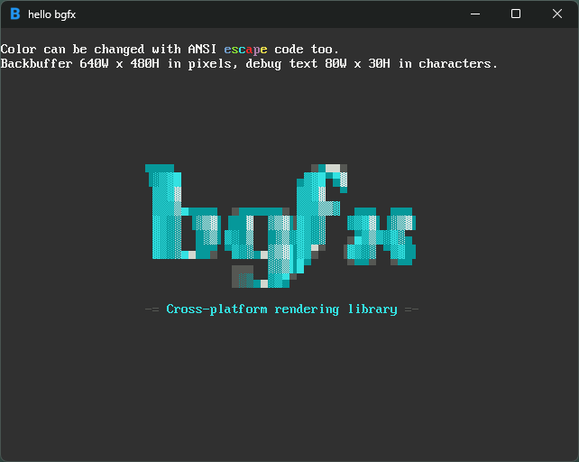

# bgfx starter

<p align="center">
  
</p>

A minimal template to get started using the cross platform graphics library [bgfx](https://github.com/bkaradzic/bgfx).
By combining bgfx with a windowing library such as [glfw](https://github.com/glfw/glfw) we can create graphical applications which run on all systems using the best graphics api available.

## Features

- Simple and clean
- Up to date
- Easy build system
- Includes common utilities

## Requirements

You need [Premake](https://premake.github.io) in your ```PATH```.

For Windows you can use either [MSVC](https://visualstudio.microsoft.com) or [MinGW](https://github.com/skeeto/w64devkit).
For Linux you need standard build tools.

For development [Visual Studio Code](https://code.visualstudio.com) is suggested with the C++ extension.

## Getting Started

To get started clone the repository and its submodules:

```
git clone --recurse-submodules https://github.com/vinnyhorgan/bgfx-starter.git
```

Then from inside the folder run:

### Windows

#### MSVC

```
premake5 vs2022
```

Then you can open the generated solution using Visual Studio.
If you have ```msbuild``` in your ```PATH```, then you can just run:

```
.\scripts\build_msvc.bat
```

#### MinGW

```
premake5 gmake
```

Then:

```
.\scripts\build_mingw.bat
```

### Linux

On linux you can choose between X11 and Wayland.

#### X11

```
premake5 gmake
```

#### Wayland

```
premake5 --use-wayland gmake
```

Then:

```
./scripts/build_linux.sh
```

### macOS

On macOS you can run the provided build script which will handle project generation and building:

```bash
./scripts/build_macos.sh
```

## TODO

- [x] Add macOS support
- [ ] Fix any issues

## Credits

Thanks to all the following amazing projects:

- [bgfx](https://github.com/bkaradzic/bgfx)
- [glfw](https://github.com/glfw/glfw)
- [glm](https://github.com/g-truc/glm)
- [stb](https://github.com/nothings/stb)
- [icon](https://www.flaticon.com/free-icon/letter-b_3541184?term=b&page=1&position=38&origin=tag&related_id=3541184)

This template actually uses a fork of glfw that fixes event blocking on Windows:

- [glfw fork](https://github.com/mmozeiko/glfw/tree/unblock_events_windows_move_resize)
